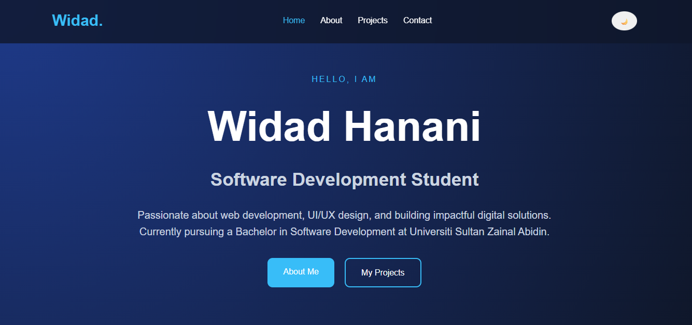

# Personal Blog Portfolio

## Project Description

This is a personal blog portfolio website created for the CSD34203 Special Topics in Software Development individual project.

The website is developed using HTML, CSS, and JavaScript to showcase my personal background, skills, project experience, achievements, and contact information. This project also demonstrates the use of Git, GitHub, and GitHub Pages for version control and project deployment.

---

## Live Demo

https://widadhanani.github.io/personal-blog/

---

## Features

- Responsive personal portfolio website
- Home page with introduction section
- About page with education, skills, and leadership background
- Projects page showcasing completed software projects
- Contact page with personal contact information
- Dark mode toggle using JavaScript
- Modern glassmorphism UI design
- Smooth hover animation
- Mobile-friendly layout
- Organized project folder structure

---

## Projects Included

- Legacy Recipe System
- Quality Document Management System
- Smart Reaction Time Tester for Sport Training
- UNIPASS Smart QR Vehicle Access System
- UniSZA Bus Tracking System
- Personal Blog Portfolio

---

## Technologies Used

- HTML5
- CSS3
- JavaScript
- Git
- GitHub
- GitHub Pages
- VS Code
- Live Server

---

## Screenshot



---

## How to Run the Project

1. Download or clone this repository.
2. Open the project folder in Visual Studio Code.
3. Make sure the folder structure is correct.
4. Right click `index.html`.
5. Select **Open with Live Server**.
6. The website will open in the browser.

---

## Project Structure

```text
personal-blog/
│
├── index.html
├── about.html
├── blog.html
├── contact.html
│
├── css/
│   └── style.css
│
├── js/
│   └── script.js
│
├── screenshot.png
└── README.md